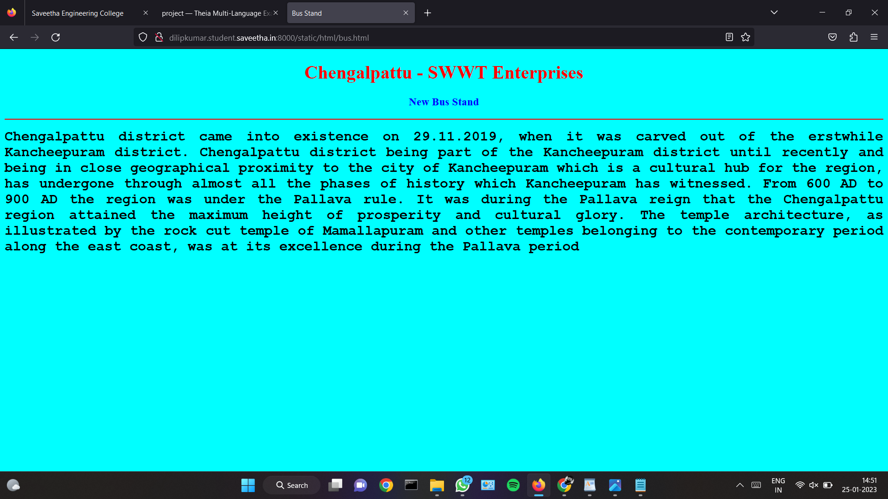

# Places Around Me
## AIM:
To develop a website to display details about the places around my house.

## Design Steps:

### Step 1:
clone the github repository into Theia IDE

### Step 2:
create a new django project

### Step 3:
write the needed HTML code.

### Step 4:
Run the django server and execute the HTML files.

## Code:
Include your HTML code here

## Output:

```
map.html
<!DOCTYPE html>
<html lang="en">
<head>
<title>My City</title>
</head>
<body>
<h1 align="center">
<font color="red"><b>Chengalpattu - SWT Enterprises</b></font>
</h1>
<h3 align="center">
<font color="blue"><b>DILIP KUMAR R (22008361)</b></font>
</h3>
<center>

<map name="MyCity">
<area shape="circle" coords="190,50,20" href="/static/html/bps.html" title="Brindavan Public School">
<area shape="rectangle" coords="230,30,260,60" href="/static/html/rto.html" title="RTO office">
<area shape="circle" coords="400,350,50" href="/static/html/ja.html" title="Jeffrey Aquarium">
<area shape="circle" coords="400,200,75" href="/static/html/bus.html" title="New Bus Stand">
<area shape="rectangle" coords="490,150,870,320" href="/static/html/park.html" title="Joy Park">
</map>
</center>
</body>
</html>

bus.html
<!DOCTYPE html>
<html lang="en">
<head>
<title>My City</title>
</head>
<body>
<h1 align="center">
<font color="red"><b>Chengalpattu - SWT Enterprises</b></font>
</h1>
<h3 align="center">
<font color="blue"><b>DILIP KUMAR R (22008361)</b></font>
</h3>
<center>

<map name="MyCity">
<area shape="circle" coords="190,50,20" href="/static/html/bps.html" title="Brindavan Public School">
<area shape="rectangle" coords="230,30,260,60" href="/static/html/rto.html" title="RTO office">
<area shape="circle" coords="400,350,50" href="/static/html/ja.html" title="Jeffrey Aquarium">
<area shape="circle" coords="400,200,75" href="/static/html/bus.html" title="New Bus Stand">
<area shape="rectangle" coords="490,150,870,320" href="/static/html/park.html" title="Joy Park">
</map>
</center>
</body>
</html>

park.html
<!DOCTYPE html>
<html lang="en">
<head>
<title>Joy Park</title>
</head>
<body bgcolor="yellow">
<h1 align="center">
<font color="red"><b>Chengalpattu - SWT Enterprises</b></font>
</h1>
<h3 align="center">
<font color="blue"><b>Joy Park</b></font>
</h3>
<hr size="3" color="red">
<p align="justify">
<font face="Tahoma" size="5">
A very nice park near chengalpattu bus stand. It is located surrounding the kolavai Lake. 
Very superb calm place in chengalpattu. Best for walking. Nice playing place for kids.
Well maintained with jogging track. Source of ground water.
Good place play with children.  In Banyan Tree lot of parrot stay like house. 
Good sound and Air. Lake view park looks awesome.
Very nice place at chengalpattu.
Simple and relax with play area.
</font>
</p>
</body>
</html>

rto.html
<!DOCTYPE html>
<html lang="en">
<head>
<title>RTO Office</title>
</head>
<body bgcolor="pink">
<h1 align="center">
<font color="red"><b>Chengalpattu - SWT Enterprises</b></font>
</h1>
<h3 align="center">
<font color="blue"><b>RTO Office</b></font>
</h3>
<hr size="3" color="red">
<p align="justify">
<font face="Arial" size="5">
<b>
RTO office or the Regional Transport Office is a government body specifically established to oversee all transport-related operations in the country. RTOs are located throughout the country in each state and union territory. RTOs are responsible for enforcing the rules as laid down by the Motor Vehicle Act of 1988.
The department also maintains a database of all the vehicles operating in the country as well as issues licenses for drivers. Besides, the RTO office also collects road taxes, supervises pollution checks, and ensures the enforcement of all road transportation rules. If you own or drive a vehicle in India, you will need to visit the RTO to get your vehicle registered, obtain a driver’s license or renew your driver’s license, etc.
RTOs are also responsible for improving road and vehicle safety, especially to avoid accidents and other road fatalities.
</b>
</font>
</p>
</body>
</html>

bps.html
<!DOCTYPE html>
<html lang="en">
<head>
<title>Brindavan Public School</title>
</head>
<body bgcolor="lime">
<h1 align="center">
<font color="red"><b>Chengalpattu - SWT Enterprises</b></font>
</h1>
<h3 align="center">
<font color="blue"><b>Brindavan Public School</b></font>
</h3>
<hr size="3" color="red">
<p align="justify">
<font face="Georgia" size="5">
The main objectives of Chengalpattu Brindavan Public School are 
<ul>
<li>To impart proper and qualified training to teachers and give them an attractive salary and incentives so that they are not tempted to quit and look elsewhere for jobs.</li>
<li>To provide financial aids and grants wisely and judiciously.</li>
<li>To Frame of syllabus and curriculum.</li>
<li>To set aims and objectives of education.</li>
</ul>
</font>
</p>
</body>
</html>

ja.html
<!DOCTYPE html>
<html lang="en">
<head>
<title>Jeffrey Aquarium</title>
</head>
<body bgcolor="orange">
<h1 align="center">
<font color="red"><b>Chengalpattu - SWT Enterprises </b></font>
</h1>
<h3 align="center">
<font color="blue"><b>Jeffrey Aquarium</b></font>
</h3>
<hr size="3" color="red">
<p align="justify">
<font face="Georgia" size="5">
The uses of Jeffrey Aquarium in Chengalpattu District are 
<ol type="1">
<li>Aquarium is used for survive the fishes.</li>
<li>It is used for somr astrological ethics.</li>
<li>Used for competitions.</li>
<li>used for learning fish culture.</li>
</ol>
</font>
</p>
</body>
</html>
```

## Output:





## HTML Validator


## Result:

Program executed successfully